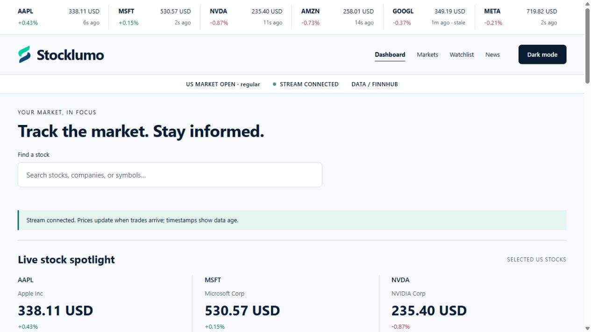

# Stocklumo

Stocklumo is an ASP.NET Core 10 MVC stock-tracking application powered by Finnhub. It combines an editorial financial interface with live prices, company pages, a browser-local watchlist and source-linked news.



Captured from the running application on 8 October 2026. Prices in the screenshot are historical observations, not current quotes.

## Features

- Dashboard, Markets, Watchlist and News routes, plus `/stock/AAPL` style company pages.
- Live six-stock ticker on every page, with timestamps and shared subscriptions. Twelve exploration links expand to twenty-four. The connection pulse respects reduced-motion settings.
- Debounced company/symbol lookup with cancellation and keyboard-accessible results.
- Quote prices, previous-close changes, available daily statistics and company profiles.
- Shared server-side WebSocket feed with subscription reference counts, unsubscribe, idle disconnect, reconnection, bounded messages and shutdown cancellation.
- Server-sent events deliver price snapshots to browsers once a second without exposing credentials. Multiple ticks may be coalesced.
- A 20-stock watchlist with add/remove/move-up controls and eight recently viewed stocks, saved in this browser.
- Interactive session chart, pointer and keyboard inspection, and plan-dependent historical ranges. Historical controls appear only when the provider returns candle data.
- Market status, live stock spotlight and news with explicit setup, unavailable and error states.
- Light and dark themes, responsive layouts, semantic controls, visible focus, and signed price changes.
- A ribbon-style SVG mark based on the supplied brand reference, local assets and no frontend runtime framework or CDN dependencies.

## Data limitations

Authenticated local verification on 8 October 2026 confirmed Finnhub company search, AAPL/MSFT quotes and live trades, company profiles, basic metrics, news and US market status. Two browser clients shared one upstream connection; closing all site tabs released it. The API key is stored outside the repository in ASP.NET User Secrets and was checked against served pages, assets and source files for accidental exposure.

The tested account returned unavailable responses for historical candles and the three index quotes. The dashboard replaces unavailable indices with a live AAPL/MSFT/NVDA spotlight, clearly labeled as selected stocks rather than an index or ranking. Historical charts retain their unavailable state; the live session chart remains available. Account entitlements and provider availability can change. Render Free hosting was deployed and verified on 9 October 2026. An external penetration test has not been completed.

Local verification passed 48 backend tests and ten frontend tests. The Release publish command also succeeded. Browser checks covered keyboard search and chart inspection, watchlist persistence/reordering, dark/light themes, mobile/tablet/desktop layouts, idle feed cleanup, and connection-loss/recovery during a server restart. Dependency checks reported no known vulnerabilities at the time of review. This does not establish that every failure mode or deployment environment has been tested.

The app never substitutes invented prices, news or company profiles. Starter company names are navigation labels, not price data or a trending ranking. Historical endpoints may not be supported by your Finnhub plan. Unavailable data stays unavailable; ETFs are not silently substituted for indices. Session history contains only observations received while the page is open and resets on reload. News excerpts come from Finnhub and link to their original publisher. Company description and volume are omitted when the selected endpoints do not provide them.

## Stack and structure

C#, ASP.NET Core 10 MVC, Razor, HTML, CSS, plain JavaScript, xUnit and ASP.NET Core TestHost. Node and jsdom are used **only for frontend tests**, not to run the website.

- `MarketDesk/Program.cs` registers services and configures middleware, security headers, HTTPS and rate limits.
- `MarketDesk/Controllers/MarketController.cs` serves pages and the browser event stream.
- `MarketDesk/Controllers/DataController.cs` validates public requests and constructs fixed Finnhub endpoint paths.
- `MarketDesk/Services/FinnhubApi.cs` owns the shared REST cache, request budget, credential handling and safe provider errors.
- `MarketDesk/Services/FinnhubFeed.cs` manages the one upstream WebSocket and cached quote refreshes.
- `MarketDesk/Services/MarketStore.cs` synchronizes price state and counts browser subscriptions.
- `MarketDesk/Models` defines immutable price records and stock-symbol validation.
- `MarketDesk/Views/Market/Index.cshtml` and `MarketDesk/wwwroot` provide the interface.
- `MarketDesk.Tests` covers server and HTTP behavior; `tests` covers frontend behavior using clearly synthetic fixtures.

The solution retains the existing `MarketDesk` project names to preserve the original app and User Secrets identity. Public branding is Stocklumo.

The provided course notes and cheat sheet guided the MVC/Razor, DI, middleware, configuration, HTTP integration, validation, logging and testing approach. A database, identity system and repository layer are not needed for this account-free, read-only market monitor. WebSocket streaming and server-sent events extend the course's HTTP integration foundation.

## Local setup

Install the .NET 10 SDK. Open `MarketDesk.slnx` in a compatible Visual Studio with the ASP.NET workload, or run from this repository:

```powershell
dotnet user-secrets set "Finnhub:ApiKey" "YOUR_FINNHUB_KEY" --project MarketDesk
dotnet dev-certs https --trust
dotnet run --project MarketDesk
```

Open https://localhost:7143. The Development launch profile also serves http://localhost:5143 and loads User Secrets. Restart after changing the key. Without a key, the app starts in setup mode.

Get a key from https://finnhub.io/. Never paste the real key into Git, JavaScript, HTML or screenshots. User Secrets are a local convenience, not an encrypted production vault. The `UserSecretsId` remains `marketdesk-finnhub-local`, preserving the previous project setup.

## Run tests

```powershell
dotnet test MarketDesk.slnx -c Release
npm ci --ignore-scripts
npm test
dotnet list MarketDesk.slnx package --vulnerable --include-transitive
npm audit
```

Backend tests cover price ordering, nullable calculations, payload parsing, subscription cleanup and capacity, symbol validation, shared caching, credential isolation, 401/403/429 handling, rate limits, SSE delivery, page routing, invalid requests, HTTPS/HSTS and response headers. Frontend tests cover supplied quote/profile rendering, local persistence, theme selection, news escaping, unsafe links, chart inspection, delayed quotes, unverified saved symbols and missing-key states.

## Live verification after configuration

1. Stop other Stocklumo instances sharing this key. Start the configured app and search for a company such as Apple.
2. Open a result; compare its quote, timestamp, currency and exchange with the provider response. A current connection alone does not establish a fresh price.
3. During that stock's trading session, verify incoming trades change the displayed price without a reload. Open two tabs and confirm only one upstream WebSocket is used.
4. Add, remove and reorder watchlist entries; reload and navigate back through recently viewed stocks.
5. Close the tabs and verify subscriptions are released and the idle upstream connection closes. Reopen a stock and verify reconnection.
6. Verify candle, news, market-status and spotlight access for your actual plan. Check unavailable states for endpoints outside the plan.
7. Interrupt network access and restore it; verify stale labels, backoff and recovery. Confirm the API key is absent from browser requests, HTML and logs.

## Security review and boundaries

- All user-facing endpoints are read-only. Watchlists and theme changes happen in localStorage, not authenticated server mutations. No authentication cookies or database exist, so cookie flags, SQL injection and authenticated CSRF do not apply to this version.
- Symbols are length-limited and allowlisted. Search text is bounded and URL-encoded. Provider URLs are constructed on the server and HTTP redirects are disabled; clients cannot choose an upstream host.
- CSP allows only local scripts/styles/connections/images and forbids framing and base URLs. Dynamic values use Razor encoding or DOM textContent. Publisher/company URLs require HTTP(S) without embedded credentials; external links use noopener/noreferrer.
- The key is sent in the REST authentication header. Finnhub requires the key in its WebSocket URL; exception messages and HTTP-client request logs are not emitted. Avoid enabling URI tracing in production.
- Provider errors return safe messages. A 429 creates a 60-300 second shared cooldown; unauthorized access also backs off. No provider error body is sent to users.
- REST usage is capped at 45 uncached requests per minute per process. Requests are serialized and identical requests share cached results. Cache accounting is bounded to approximately 16 MiB of payload/key text; response bodies are capped at 2 MiB and WebSocket messages at 256 KiB.
- At most 40 distinct live symbols and 100 browser event streams are active per process. Each browser requests at most 27 symbols: twenty watchlist entries, the selected stock and six ticker stocks. Stored server stock entries are bounded to 256. These controls limit resources; they do not replace edge-level abuse protection.
- Quotes and news retain timestamps. Live-feed status and market-open status are distinct. Network silence marks the connection disconnected, and old price timestamps are labeled stale.
- Production uses HTTPS redirection, HSTS, host filtering, safe exception responses and no permissive CORS policy. HTTPS port defaults to 443.

This is a code-level review and automated verification, not a penetration-test certificate or a guarantee of permanent security. Keep dependencies and the runtime patched and assess the actual deployment.

## Deployment

```powershell
dotnet publish MarketDesk -c Release -o publish
```

Run the published app with a supported .NET 10 ASP.NET Core runtime. Configure:

- `ASPNETCORE_ENVIRONMENT=Production`
- `Finnhub__ApiKey` through your hosting secret store.
- `AllowedHosts` as your exact public hostname; the checked-in default permits local hosts only.
- Valid TLS at Kestrel or your reverse proxy.

With a TLS-terminating proxy, configure ASP.NET Core Forwarded Headers with **explicitly trusted proxy addresses** before HTTPS redirection. Do not accept arbitrary forwarded headers. Configure the proxy to pass through `/api/market/stream` without buffering or caching and allow long-lived responses. Outbound HTTPS and WebSockets to Finnhub must be permitted. Ensure monitoring does not log secret-bearing URLs.

Run one app instance per Finnhub key. Finnhub documents one WebSocket connection per key; scaling to multiple instances requires a separate feed service and shared distribution. Confirm your plan and intended redistribution rights before public launch. Public HTTPS routes, security headers, provider quotes and the event stream were verified on Render Free on 9 October 2026.

## Branding and references

The Stocklumo ribbon mark was redrawn as SVG from the user-provided brand reference, with navy/mint light and dark variants. Initial exact-name web searches found no matching use on 8 October 2026; trademark, domain and social-handle clearance have not been established.

- https://finnhub.io/docs/api
- https://finnhub.io/docs/api/websocket-trades
- https://github.com/Finnhub-Stock-API/finnhub-go/blob/master/api/openapi.yaml
- https://www.udemy.com/course/asp-net-core-true-ultimate-guide-real-project/


## Final local review - 9 October 2026

48 backend tests and 10 frontend tests pass. The dependency scans reported no known vulnerabilities. Malformed company profile payloads now return an unavailable result instead of causing a server error. The source package excludes credentials, dependency caches, build output, temporary files and Git metadata. This is a local code review, not an independent penetration test. Published at https://stocklumo.onrender.com from the private https://github.com/omarhussainfahmi/stocklumo repository. GitHub verification passed. Public routes, health, assets, HTTPS security headers, real provider quotes and connected SSE responses passed deployment checks. Quote changes during an open trading session were not observed in this deployment check; the provider reported pre-market and older quotes were correctly labeled stale.

Cloudflare Containers can host the ASP.NET Core application; static Pages uploads cannot run its server. Containers require the Workers Paid plan and usage charges (https://developers.cloudflare.com/containers/platform/pricing/). Do not upload the source ZIP as a static website.


## Render Free

The root Dockerfile builds the .NET 10 application and runs it as an unprivileged user on port 10000. The Docker context excludes local secrets, build output and development dependencies. `render.yaml` selects the Free web-service plan with `/health` as a process health check, independent of Finnhub availability.

Connect this repository to Render, select Docker and the Free instance, and configure `Finnhub__ApiKey` as a secret environment variable. Do not add payment details or select paid add-ons. Render supplies `RENDER=true` and `RENDER_EXTERNAL_HOSTNAME`. Only in Production on Render, the app accepts that exact hostname and uses Render's documented HTTPS-only public edge; it does not trust client-supplied forwarded headers. Custom domains require updating the explicit host policy before use. Other hosting environments retain HTTPS redirection.

Run one instance, and stop local live-feed sessions using the same Finnhub key before production verification. Free services sleep after 15 minutes without inbound traffic and may take about one minute to wake. Monthly usage limits and external traffic restrictions apply. This is portfolio hosting without an uptime guarantee. See https://render.com/docs/free and https://render.com/docs/tls.

